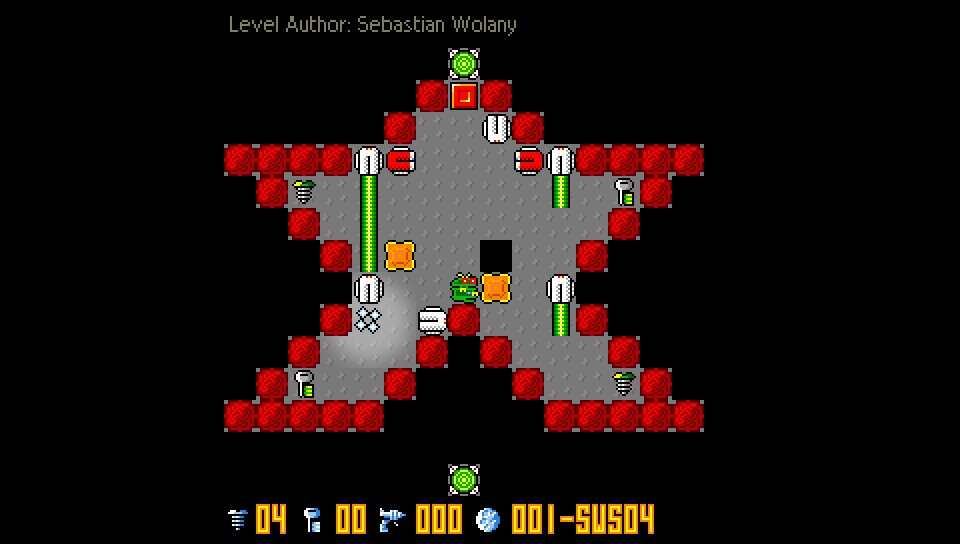
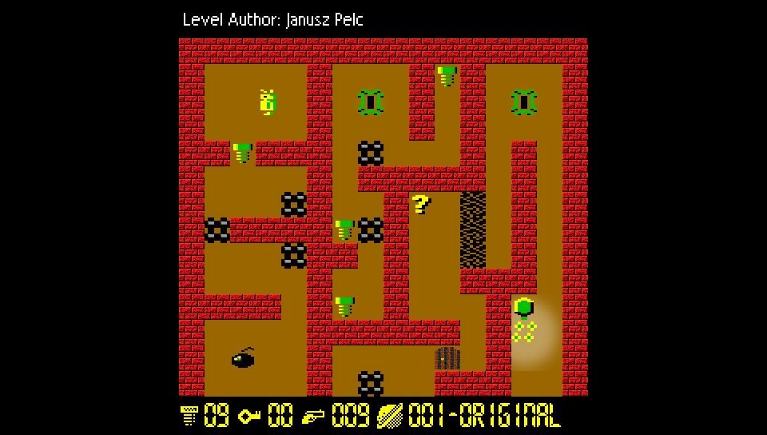
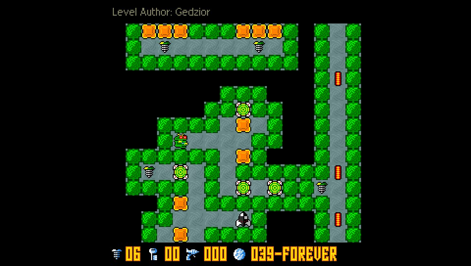
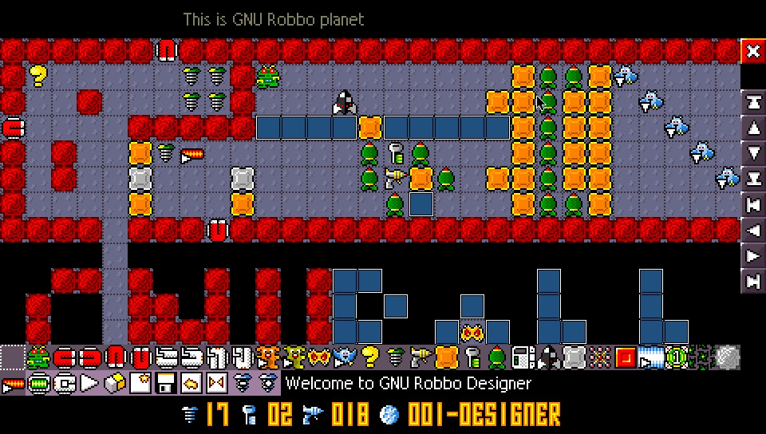

#GNU Robbo for Playstation Vita and Playstation Portable

This is a new port of GNU Robbo action puzzle video game for Sony Playstation Vita and a major upgrade of existing port of GNU Robbo (version 0.66) for Sony Playstation Portable.

http://gnurobbo.sourceforge.net

GNU Robbo is a free open source reimplementation of game designed by Janusz Pelc and published by LK Avalon in 1989 for the Atari XL/XE computers. A success on the Polish domestic market, it was later ported to other computer platforms and also released in the United States as The Adventures of Robbo.

https://en.wikipedia.org/wiki/Robbo_(video_game)

For more information on game history please read README file.

This port is based on GNU Robbo release 0.68.

##Game screenshots

Screenshots of various levels and built-in level editor

<figure>
  <figcaption>Level 001 (SWS04 level pack)</figcaption>
  
</figure>
<figure>
  <figcaption>Level 001 (Original level pack)</figcaption>
  
</figure>
<figure>
  <figcaption>Level 039 (Forever level pack)</figcaption>
  
</figure>
<figure>
  <figcaption>Level opened in level editor (GNU Robbo Designer)</figcaption>
  
</figure>

##New features (PS VITA and PSP)
*  PS VITA support
*  game built-in level editor (PS VITA and PSP)
*  39 new level packs
*  graphical improvements (smooth board scrolling, explosion lightning effects)

##Unique game features
*  graphical skin support (customization of graphical elements)
*  sound skin support (customization of sound sets)
*  customizable in-game controls
*  support for locales: English, Czech, German, Indonesian, Polish, Russian, Slovak and Swedish
*  in-game help

##Game built-in level editor (GNU Robbo Designer)

If you have mastered the game or would like to express your creative skills, you can become a designer and use level editor to create new or modify existing challenges and immediately test your ideas in the game. If you want to share new level packs, contact the Authors. Every level creator is credited with his/her name during a level game play.

Modified level packs can be found in:
*  ux0:/data/gnurobbo/levels (PS VITA)
*  data/gnurobbo/levels (PSP)

If you want to start designing a level from scratch, MyLevels pack is a good starting point.

For details of using level editor please read "Level Designer" section of README file.

##Binary installation

###Playstation Vita
https://github.com/bomblik/GNU_Robbo_PSVITA_PSP/releases/tag/GNU_Robbo_0.68_PSVITA

Install vpk file according to instructions found on

https://henkaku.xyz/usage

###Playstation Portable
https://github.com/bomblik/GNU_Robbo_PSVITA_PSP/releases/tag/GNU_Robbo_0.68_PSP

Copy release directory to Sony PSP device
(e.g. to ms0:/psp/game directory on Memory Stick).

##Source installation

###Compilation

####Playstation Vita
In order to compile GNU_Robbo for PS VITA, please install vitasdk
and set development environment.

To compile project invoke

    make -f Makefile.psvita

####Playstation Portable
In order to compile GNU_Robbo for PSP, please install psptoolchain
and set development environment.

To compile project invoke

    make -f Makefile.psp

To prepare data for installation invoke

    make -f Makefile.psp release

###Installation

Follow instructions from Binary installation section

##Default key mappings

    CROSS                    - confirm
    CIRCLE                   - cancel / exit

    D-PAD                    - move Robbo / move cursor in Designer
    D-PAD + CROSS            - shoot

    LEFT_JOYSTICK            - scroll level in Designer

    TRIANGLE                 - modify current level in Designer (after starting a level)

    START                    - restart level (in case Robbo is stuck)

    RIGHT TRIGGER            - next level pack
    LEFT TRIGGER             - previous level pack

##Credits

The GNU Robbo Team for a great game.
 
Team Molecule for HENkaku homebrew enabler.
 
All vitasdk contributors.
 
xerpi for SDL library port.
 
Cpasjuste for ports of SDL auxiliary libraries and PSP2SHELL.

##Tips

If you want to shorten scrolling time after restarting level, move Robbo with D-PAD button.

Prepare to die a lot :)
